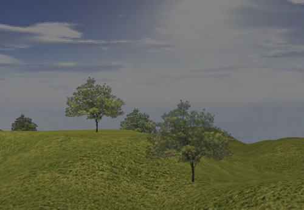



## DirectX8 1st Person 3D Game \(Landscape Terrain\)

### Description

UPDATE: ***

It loads a heightmap in grayscale to generate

custom landscapes. It can load just bitmaps with

180x180 pixels, I can't make it load a bigger than that. I've set the MAGFILTER to POINT to fix the "mix" problem of the sky, but the textures looks horrible. Try to help me please.

This is my first DirectX 8 program. It has some great subs to help you to add walls, floors, roofs, sky, trees (billboarding) and other stuff. It has a good collision detection and you can look around with the mouse.

I need some help to fix the sky, it need to be like the sky of TrueVision.

And I can't understand lights, please help with this.

PLEASE, VOTE FOR ME IF YOU LIKE IT AND LEAVE SOME FEEDBACKS, TELL ME WHAT YOU THINK.

Sorry, I couldn't upload it to PSC, I don't know why. Please download it at: http://planeta.terra.com.br/informatica/fredisoft/downloads/DirectX8Game2.zip

You can also, download at:

http://www.luzecena.com/fredisoft/DirectX8Game2.zip

** IMPORTANT **

Do not use any downloader, like GetRight, Gozzila, etc...

Turn it off.
 
### More Info
 

             |
---                |---
**Submitted On**   |2002-03-20 20:42:34
**By**             |[Frederico Machado](https://github.com/Planet-Source-Code/PSCIndex/blob/master/ByAuthor/frederico-machado.md)
**Level**          |Intermediate
**User Rating**    |4.9 (193 globes from 39 users)
**Compatibility**  |VB 6\.0
**Category**       |[DirectX](https://github.com/Planet-Source-Code/PSCIndex/blob/master/ByCategory/directx__1-44.md)
**World**          |[Visual Basic](https://github.com/Planet-Source-Code/PSCIndex/blob/master/ByWorld/visual-basic.md)
**Archive File**   |[DirectX8\_1727314162002\.zip](https://github.com/Planet-Source-Code/frederico-machado-directx8-1st-person-3d-game-landscape-terrain__1-32719/archive/master.zip)

